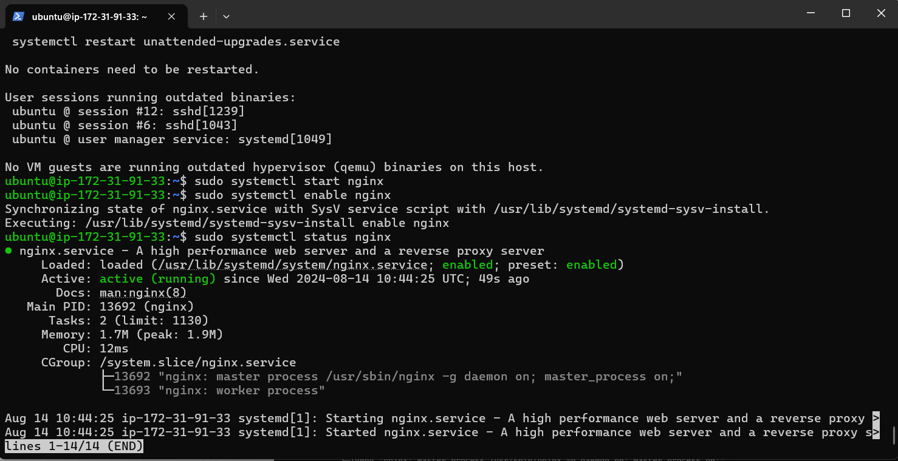
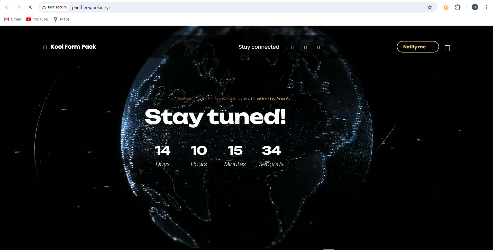

# My name is Jamaldeen

Creating my first documentation

- Launching my instance using Ubuntu AMI

- Click on create new key pairs for secure connection to my instance

- Giving my key pair a name and clicking on **Create Key Pair**

- Selecting the **SSH, HTTP and HTTPS** access options and **Click on Launch Instance**

- Click on **View all instances**

- Click on the **Created Instance**

- Click on **Connect**

- Copy the command under the **SSH Client** example 

- A terminal was open in the directory where my **.pem** file was downloaded and I pasted the command

- I return to my AWS console to create and assign an Elastic IP

- Click on **Allocate Elastic IP Address**

- Keep the settings unchancged and click on **Allocate**

- Proceed to **Associate this Elastic IP Address** with my running instance

- Process to select the instance to be associated with the Elastic IP Address and click on **Associate**

> [!NOTE]
The IP Address of my instance will have been updated to the Elastic IP associated with it. Copy the new command and paste it in my terminal.

- NginX was installed using commands on the terminal

- Nginx server was stared using three different commands

- A return to the EC2 Dashboard to copy the **Public IPv4 Address**

Paste my instace **Public IPv4 Address** on a web browser to view the default **Nginx Startup Page**

- A visit to **Tooplate** to obtain a website template

- After careful selection, I right click beside the the download button and click on **Inspect**

- Click on the **Network** tab

- Click on the **Download** button

- Hover the mouse to the file that has **.zip** right click and hover the **Copy** icon to show the **copy URL**

- run this command sudo curl -o /var/www/html/2136_kool_form_pack.zip https://www.tooplate.com/zip-templates/2136_kool_form_pack.zip

- To install the unzip file; run the following command sudo apt install unzip

- Navigate to the web server directory by running the following command: cd /var/www/html

- Unzip the contents of your website by running sudo unzip 2136_kool_form_pack.zip

- Update your nginx configuration by running the command sudo nano /etc/nginx/sites-available/default. Then, edit the root directive within your server block to point to the directory where your downloaded website content is stored.

- Restart Nginx to apply the changes by running: sudo systemctl restart nginx

- Open a web browser and go to your Public IPv4 address/Elastic IP address to confirm that your website is working as expected.

- Creating a Record!

- Go to namecheap list and select the icon bar

-Click on **Manage** icon

- Return to AWS Console and search for **Route53**

- Click on **Get Started**

- Select Create hosted zones and click on Get started.

- Enter the **Domain name**, choose **Public hosted zone** and then click on **Create hosted zone**.

n- Select the created hosted zone and copy the assigned Values.

- Go back to your domain registrar and select **Custom DNS** within the NAMESERVERS section. Paste the values you copied from **Route 53** into the appropriate fields, then click the **Checkmark Symbol** to save the changes.

- Head back to your AWS console and click on **Create record**

- Paste your **Elastic IP Address** and then click on **Create records**.

- My A record has been successfully created.

- Click on **Create record** again, to create the record for your sub domain. Input the **Record name(www)**, paste the **IP address**, and then click on **Create Records**.

- Restart the nginx server by running the **sudo systemctl restart nginx** command. Go to your domain name in a web browser to verify that your website is accessible.

- Installing certbot 

- Visit https://pantherapookie.xyz to view my amazing and secure website.

