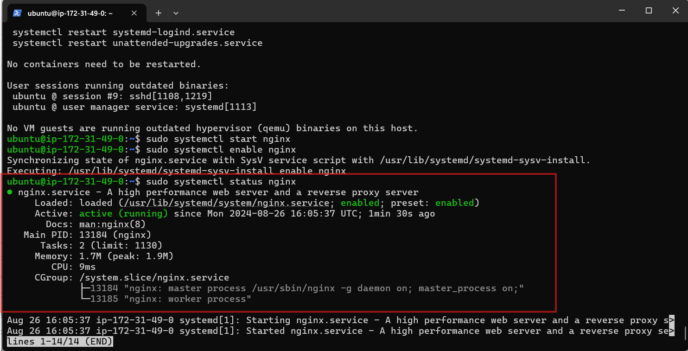
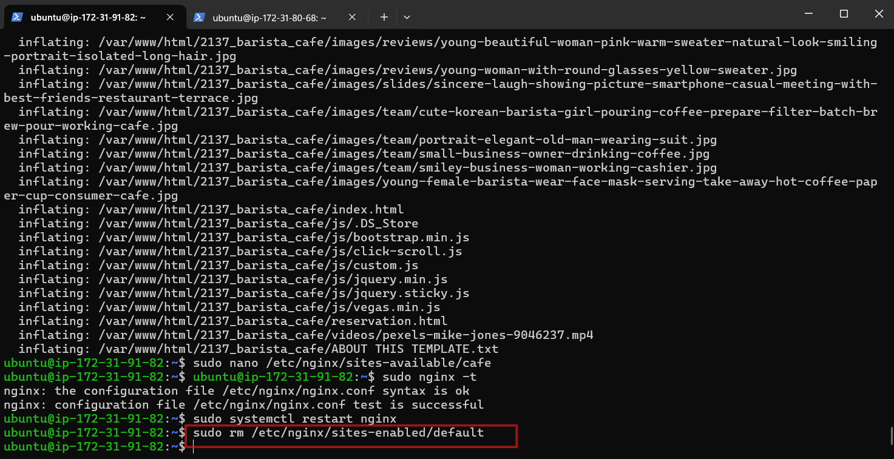

# Creating My Third Documentation

- Setting up three instances on my AWS account

- Installing NginX and setting up my website

- To set up my website's configuration by creating a new file in the Nginx sites-available directory to point to the directory where your downloaded website content is stored.. 

- Creating a symbolic link for both websites

- Running the **sudo nginx -t** command to check the syntax of the Nginx configuration file, and when successful run the **sudo systemctl restart nginx** command.

- Repeating the process for the second website

>[!NOTE]
On my first and second server, ran sudo rm /etc/nginx/sites-enabled/default. This will delete the default site-enabled folders and enable Nginx to serve content from my specified website directories.

- Checking both IP addresses to confirm my website is up and running.

- Configuring my Load Balancer

- Creating A Record

- Installing Certbot

- Checking my domain

- THANK YOU
