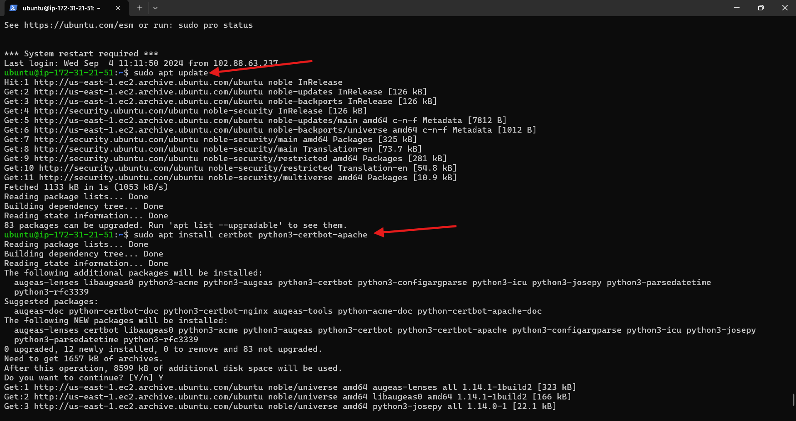

**My Fourth Documention**

# **This Project involves setting up a WordPress websit using the LAMP Stack.**

1. Spinning up an Ubuntu server on the AWS Terminal.

- An inbound rule was set for MYSQL in my security group by Clicking on Security and selecting the Security group

- Click on **Edit inbound rule**

- Click on **Add rule**

- Click on **Custom TCP** and select **MySQL/Aurora**

- Inputing my **IP Address** and clicking on **save rules**

- Ran my **SSH** command on my terminal and installing my **Apache**

- Enabling **Apache** to start on boot and confirmining it **status**

- Checking if my server is running and accessible both locally and from the Internet using the **IP Address**

- Installing **MySQL** on my terminal

- Setting password for my root user

- Starting the interactive script setting my password validation policy level.

- Enabling **MySQL** to start on boot and confirming it status

- Installing **PHP** along with required extensions

- Confirming the downloaded PHP version by running php -v

- Creating a virtual host for my Website using Apache

- Creating and opening a new configuration file in Apache's sites-available directory

- Ran the ls command **sudo ls /etc/apache2/sites-available** to show the new file in the sites-available directory.

- Enabling the new virtual host using the a2ensite command

- Disabling Apache's default website

- Ensuring my configuration file doesn’t contain syntax errors, a **Syntax OK** message should pop up

- Reload Apache

>[!NOTE]
My new website is now active, but the web root /var/www/projectlamp is still empty. Let's create an index.html file in that location to test that the virtual host works as expected.

- Using the following command: sudo echo **'Hello LAMP from Panthera' > /var/www/projectlamp/index.html** inorder to create an index.html file with content.

- Visiting my IP Address on the web browser

- Removing the index.html file

- Enabling PHP on the website

- Reloading Apache for the changes to take effect. Now, Apache will prioritize index.php over index.html when both files exist in the same directory.

- Creating a new file named index.php inside your custom web root folder

- Reloading my web browser after saving

- Installing WordPress

- Extracting the files from the downloaded WordPress archive

- Running the command ls -l to confirm the existence of the wordpress directory in the current location

- Checking the user running your web server

- Granting ownership of the WordPress directory and its files to the web server user **(www-data)**

- Creating a Database For Wordpress: Login in with previously set password when prompted

- To create a separate database named wp_db for WordPress to manage

- To access the new database, I create a MySQL user account 

- Granting all priviledges and flushing priviledges 

- exit

- Granting executable permissions recursively (-R) to the wordpress folder

- Change into the **WordPress** directory

- Configuring Wordpress

- Visiting **http://98.81.97.211:80/wordpress/** on my web browser to access the WordPress setup wizard where I can finalize the installation process.

- Enter the required information and click on **Install WordPress**

- WordPress has been successfully installed. Login in to access WordPress

- Upon login in, WordPress dashboard page pops up

- A return to AWS Console inorder to make my website accessible via my domain name rather than the IP address

- Updating my Apache configuration file in the sites-available directory to point to my domain name

- Updating my wp-config.php file with DNS settings

- A return to my browser to load the page using my domain name

- Login in to my WordPress admin portal

- Installing certbot and Requesting For an SSL/TLS Certificate

