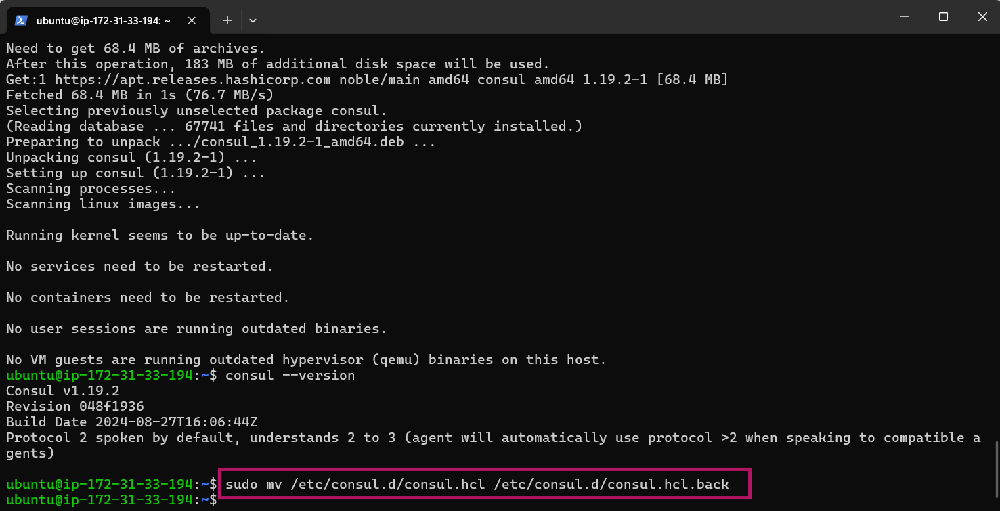
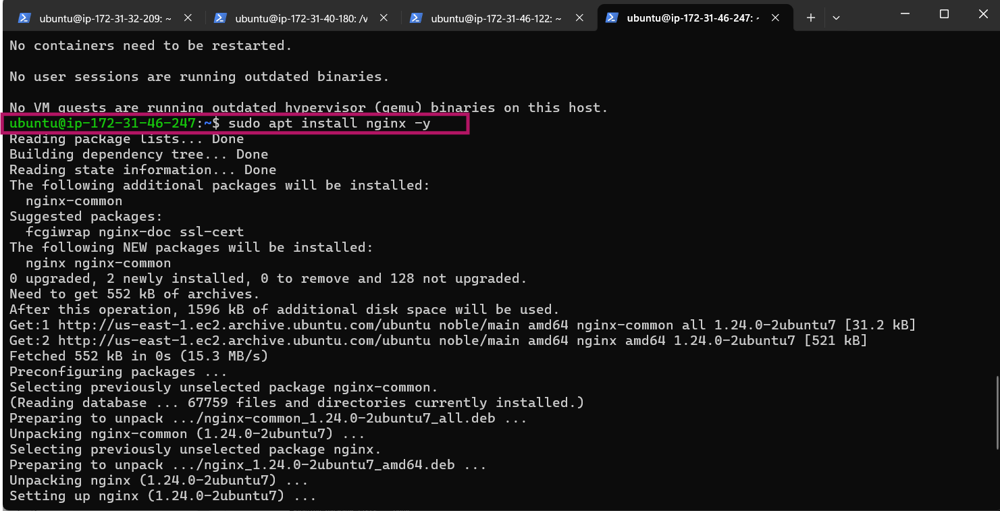

# Fifth Documentation 

- Set up four instances on my EC2 spinning up Ubuntu servers

- Renamed the instances for easy identification

- Inputing the required Consul service specific ports to function correctly. Selecting the **Consul** instance, clicking on **Security** and selecting the **Security Group**

- Click on **Edit inbound rules**

- Click on **Add rules**

- Edit **Port range** to desired port number

- Select **0.0.0.0/0.** Security measures have been intentionally relaxed by opening SSH, HTTP, HTTPS, and Consul ports to all traffic (0.0.0.0) for rapid development and testing.

>[!NOTE]
This configuration is highly insecure and should never be used in production environments. 

- Click on **Add rule** again

- Chooose **Custom UDP** 

- Enter the Port range and choose the CIDR blocks.

- Repeat the process for the remaining port configurations.

- Once completed, click on **Save rules**

- SSH into the Consul server and install **Consul**

- Confirm Consul installation by checking its version

- To configure the Consul server, start by backing up the default configuration file **consul.hcl** by renaming it to **consul.hcl.back**

- Generate an **Encrypted key**

- Creating a new file named **consul.hcl** in the **/etc/consul.d** directory and adding my **Encrypted Key**

- Starting the Consul server in the background

- Checking the status of the Consul server

- Visiting 54.152.148.66:8500 in order to access the Consul dashboard.

# Setting Up My Backends Servers

- SSH into the backend servers

- Install **NginX**

- Installing Consul as an agent on the servers.

- Verifying that Consul is installed properly

- Rename the default file and create a new one by inputing my **Encrypted Key** and my **Consul Server's IP Address**

- Verify the configurations

- Starting the Consul agent 

- To verify if everything is working correctly, visiting my  Consul UI. Once the backend listed in the UI as depicted below, it indicates that the backend has successfully registered itself with Consul.

# Setting up My Load Balancer

- SSH into my load balancer and Update the package information and install unzip

- Install **NginX**

- Download the consul-template binary

- To verify the installation of consul-template, check its version

- Creating a file named **consul-template.hcl** in the **/etc/nginx/conf.d/ directory.** This configuration file is used by consul-template to specify details about the Consul server IP and the destination path where the processed load-balancer.conf file will be saved.

- Deleting the default server configuration to disable it by running the following command

- Restarting Nginx to apply the changes

- Starting the Consul Template agent 

- Upon completion, a **load-balancer.conf** file will be created with backend server information populated from the Consul service registry.

- Accessing the load balancer IP on my web browser, it will display the custom HTML content from one of the backend servers. Upon refreshing the page, the load balancer will route my request to the other backend server, displaying its custom HTML content.

# Service Discovery Test

- Now that everything is set up and running, I can test the configuration by observing what happens when I stop one of my backend servers.

- Stopping **Nginx server** on one of the backends servers

- Stopping one of the backend servers. The Consul server will monitor the health of each registered service. Once a backend server is stopped, Consul will detect the server's unavailability and mark it as unhealthy. The health check for that server will fail, and it will be removed from the load balancer's active pool of servers.

# End of PROJECT 5

- THANK YOU