# SIXTH DOCUMENTATION

- Creating a new directory on my GitBash with the name flask_api_project. This will create the project environment

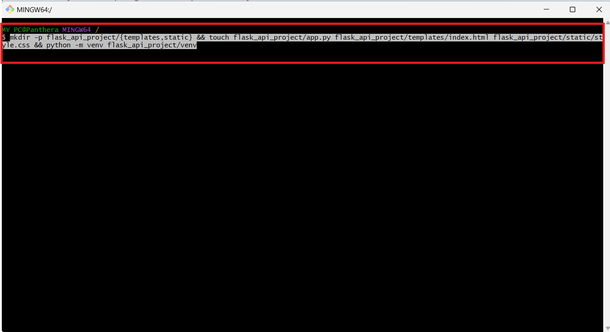

- Editing the app.py

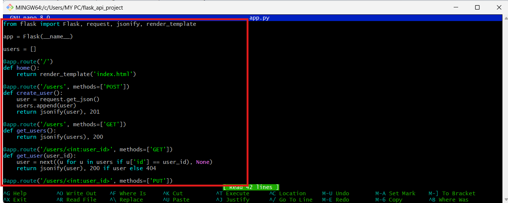

- Editing the index.html in the templates directory

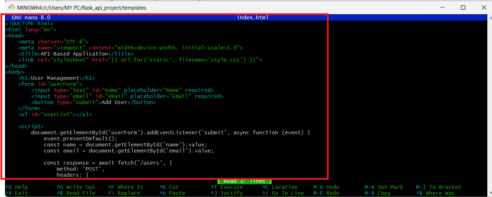

- Editing the style.css in the static directory

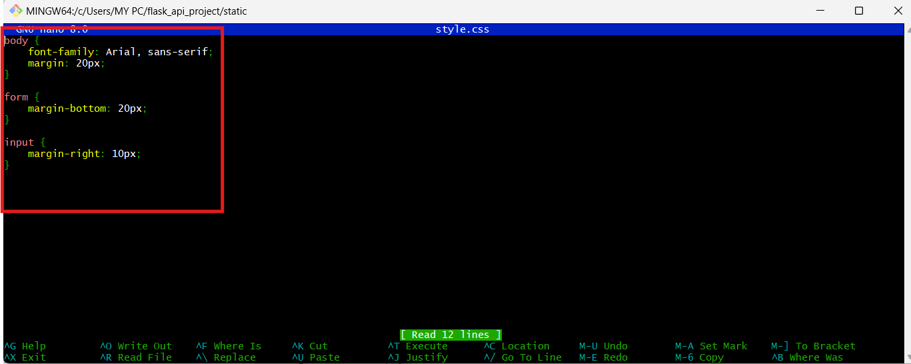

- Creating a new virtual environment for Python using the built-in module 'venv'.

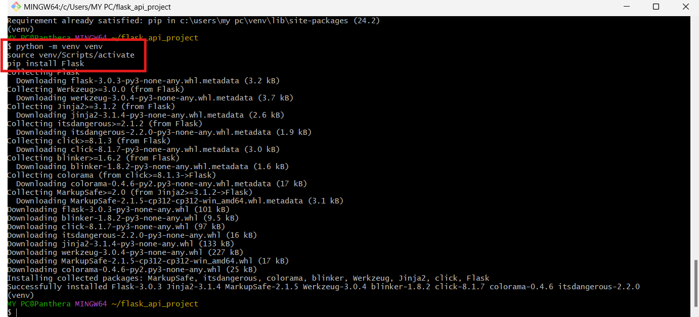

- Running the flask application;

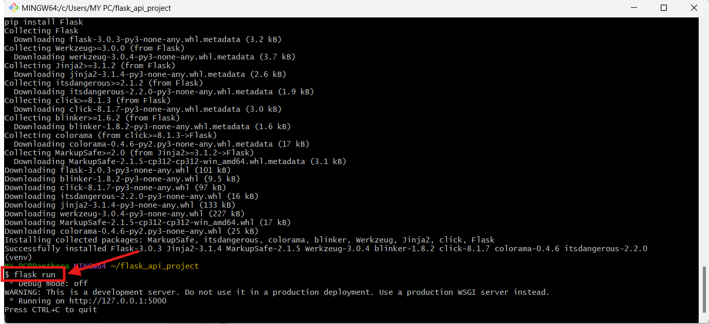

- Accessing http://127.0.0.1:5000 on my browser to see my application.

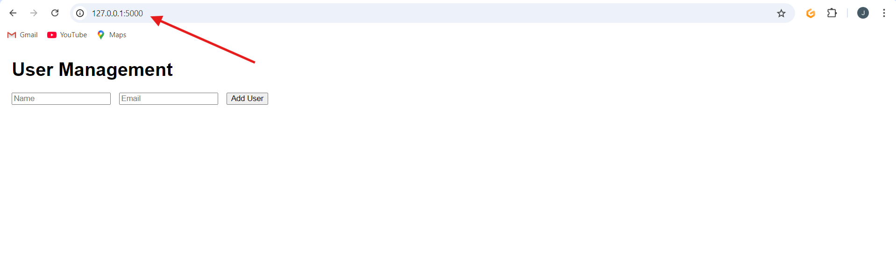

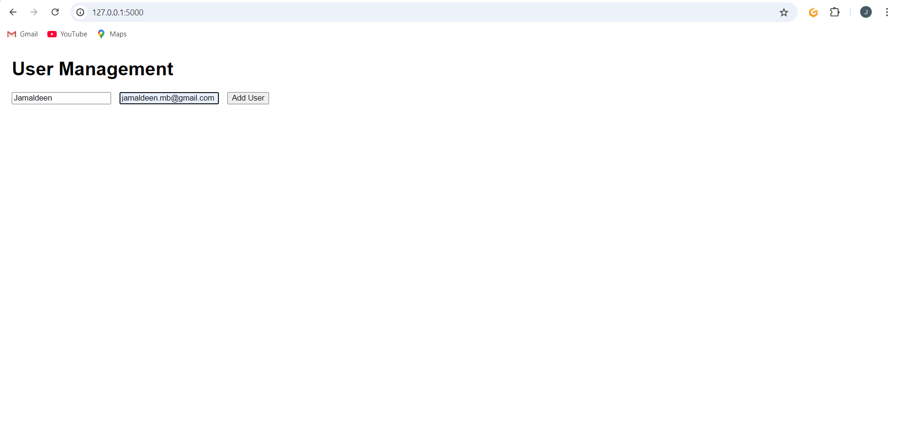

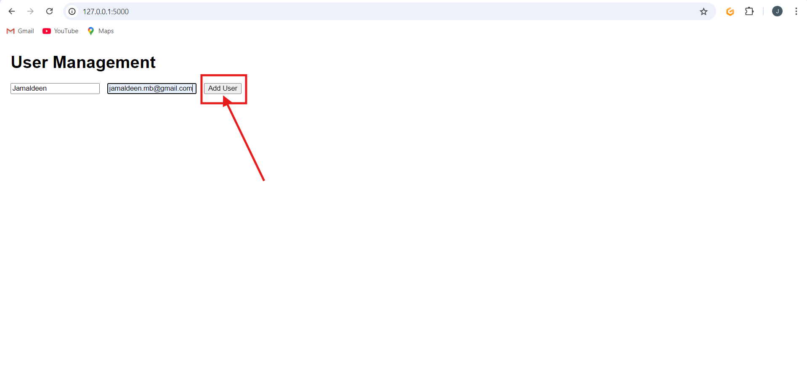

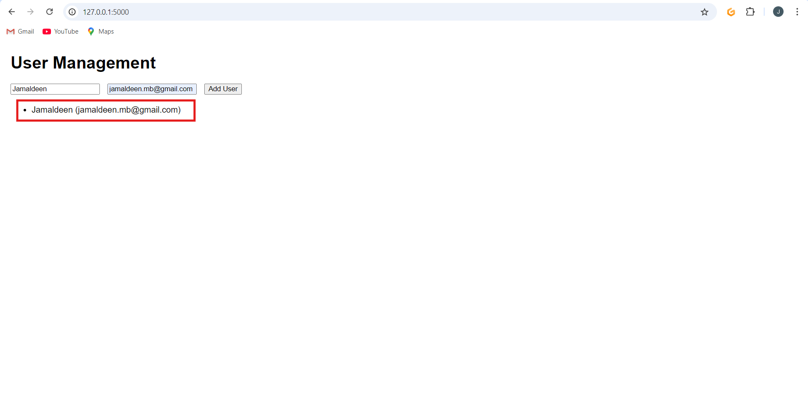

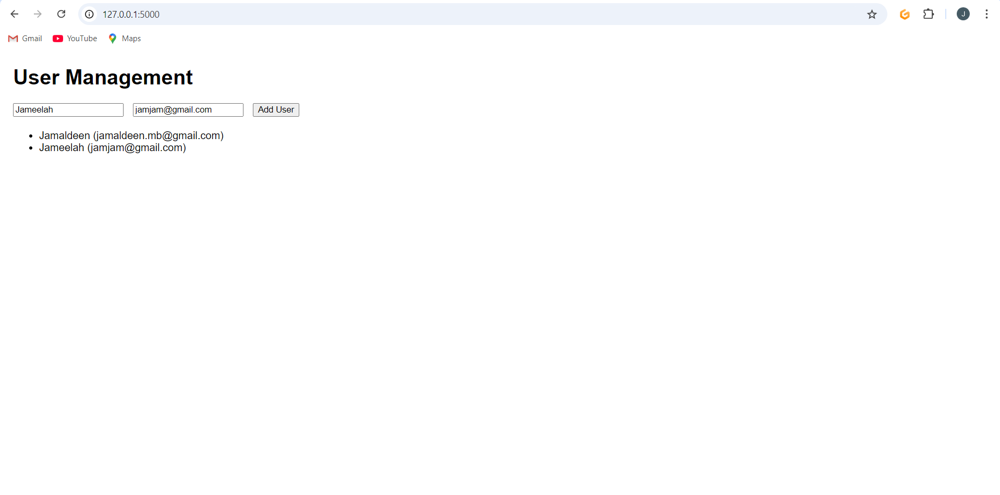

- Creating a **New request**

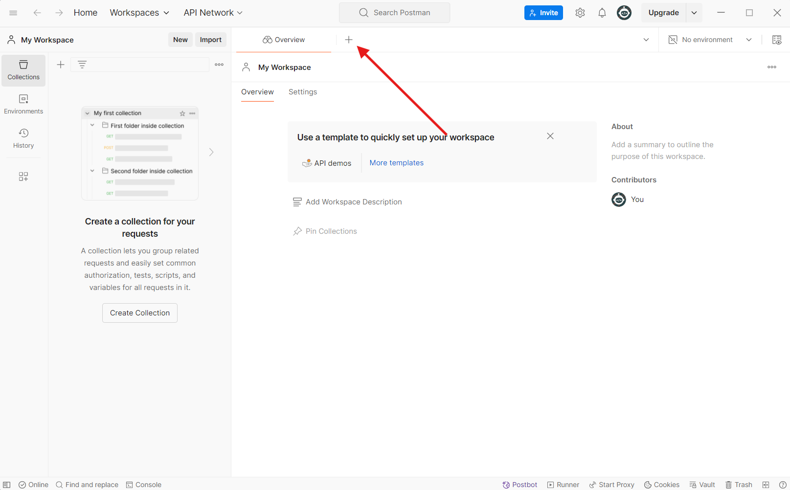

- Selecting **POST**

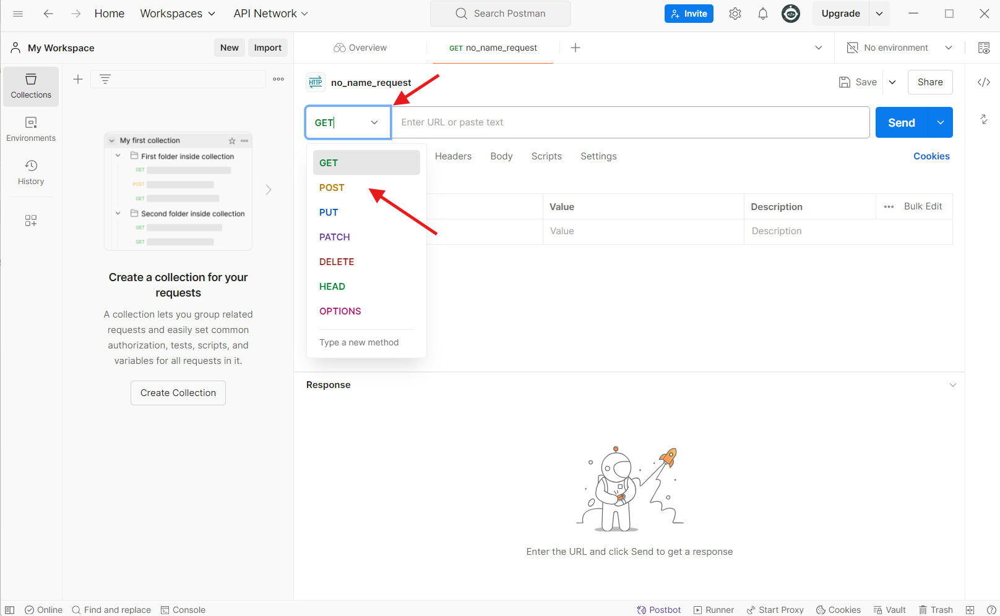

- Click on **BODY**

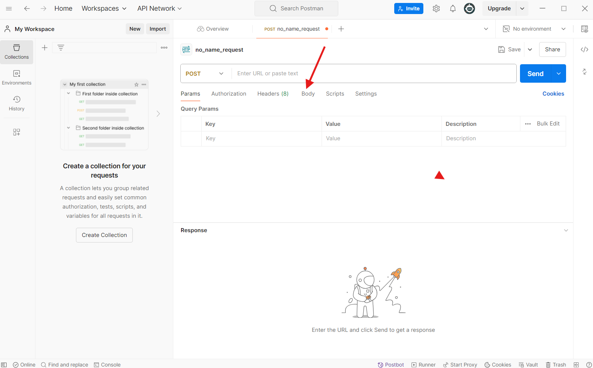

- Select **Raw**

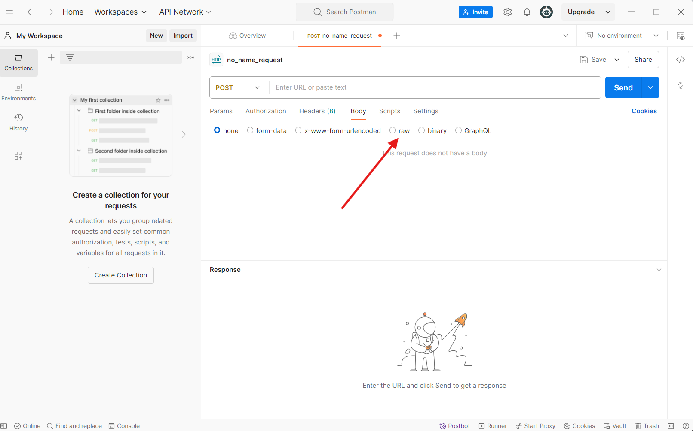

- Select **JSON**

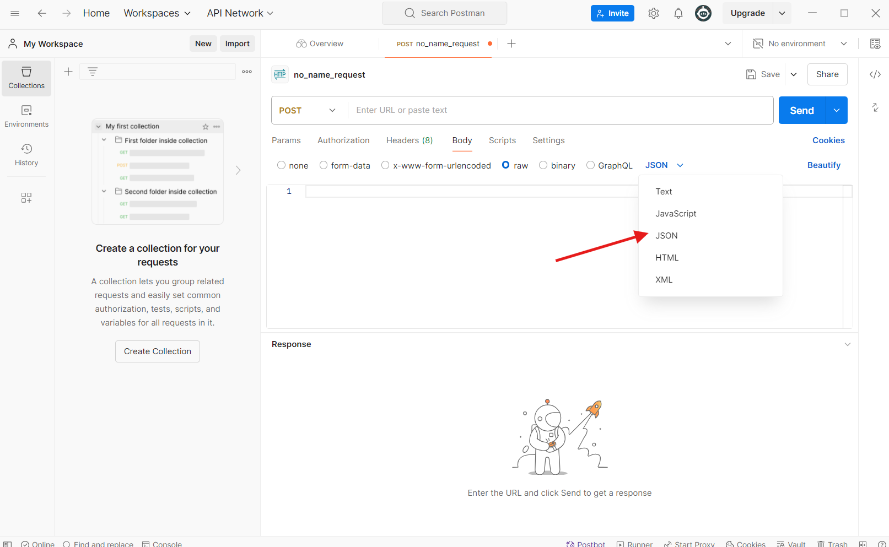

- Enter the **JSON Data**

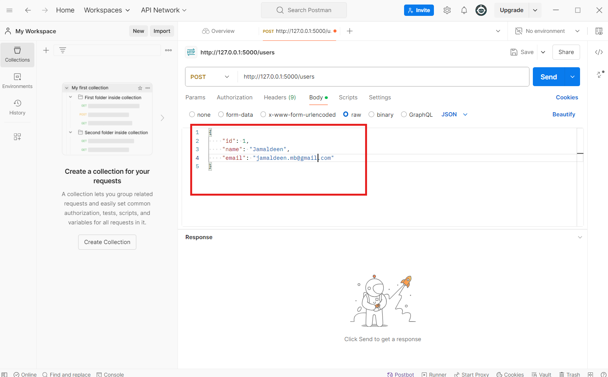

- Click on **Send**

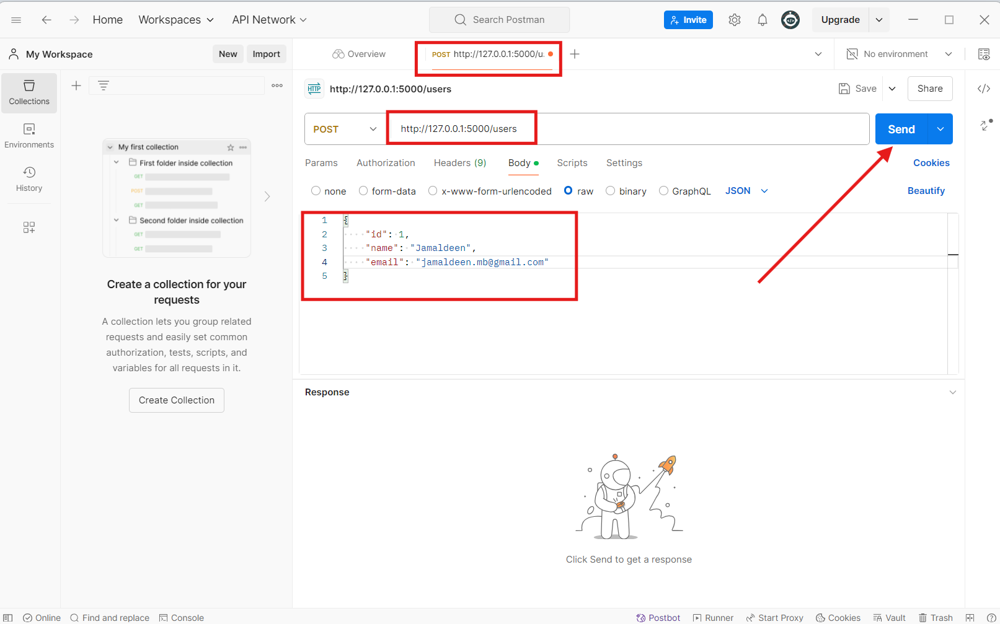

- A response will be displayed beneath with a 201 HTTP Status Code.

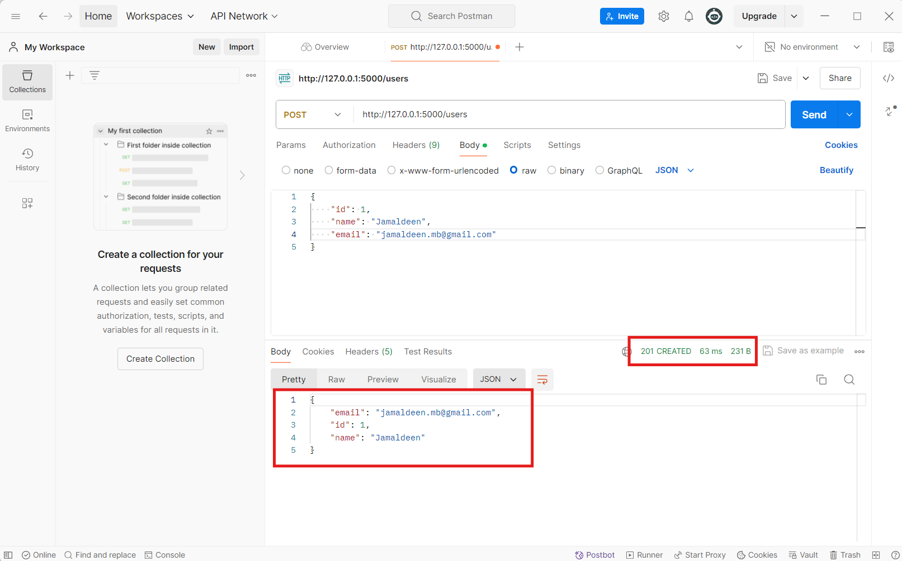

**THANK YOU**
