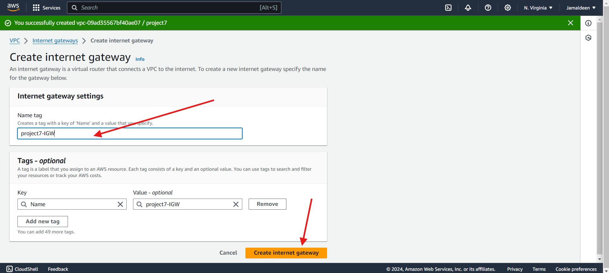

# Seventh Documentation

- Login in to my AWS management console and search VPC

- Click on **YOUR VPCs**

- Click on **Create VPC**

- Input the name and CIDR

- Click on **CREATE VPC**

- Creating an Internet Gateway

- Select create internet gateway

- Input the name tag and create internet gateway

- Select **Actions** and click **Attach to VPC**

- Select the created Project 7 VPC and attach internet gateway

- To create a public subnet, Click on Subnet and select **create subnet** 

- Select the VPC created and give the subnet a name

- Input the CIDR value

- Click on **Add new subnet**

- Input the correct details

- Create the third subnet details

- Click on Create Subnet

- Following the procedures above in creating subnet for Application, Database, Management and Platforms subnet 

- Resulting subnet;

- For each subnet group, we will create a custom route table and assign rules required for the specific subnets.
- Select Routes Table and create

# THANK YOU