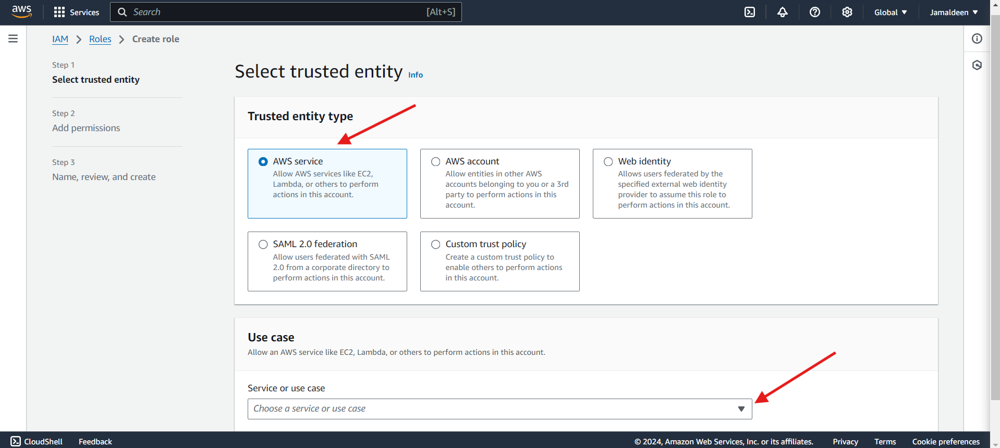

# Eighth Documentation

- Setting up my IAM Role with VPC Provisionning Permission

- Setting up my Instance on EC2

- Attaching the previously created role;

- After connecting to my instance via SSH; Installing Terraform

- Changing directoring to the terraform-vpc folder

- Editing the Owner to my name 

- Changing directory in to infra/vpc folder and initialize Terraform.

- Executing the plan

- Saving the PLAN

- Creating the VPC and related resources using terraform apply.

- Validating VPC: 15 subnets , 6 route tables, internet gateway and NAT gateway as shown below.

- Cleaning up the resources created by Terraform

# Project Completed - THANK YOU