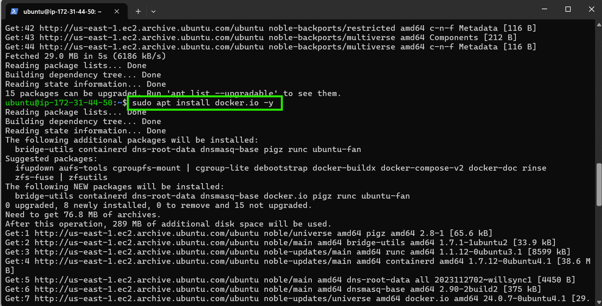

# Ninth Documentation

- Spinning up an Ubuntu 24.04 instance

- Updating my package index

- Installing **Docker**

- Starting, Enabling and checking the status of **Docker**

- Installing **Git** and cloning the project repository

- Building the Docker Image

- Checking if the image is built

- Running the **Docker Container**

- Checking if the container is running

- Testing in my Browser by accessing my EC2 public IP to check if the app is running properly:

>[!NOTE]
The webpage is not working because I have not added the port 8000 to the security group of my instance.

- Editing my inbound rules 

- Reloading my webpage

# DockerHub

- Creating a repository on my **DockerHub**

- Using the **Docker CLI** to log in to my Docker Hub account:

- Before pushing the image, I need to tag it with my Docker Hub username and the repository name. 

- Once my image is tagged, I pushed it to Docker Hub:

- After the push completes, I verified that my image is on Docker Hub by visiting my Docker Hub profile and checking the repositories.

# Project Completed
# THANK YOU!
